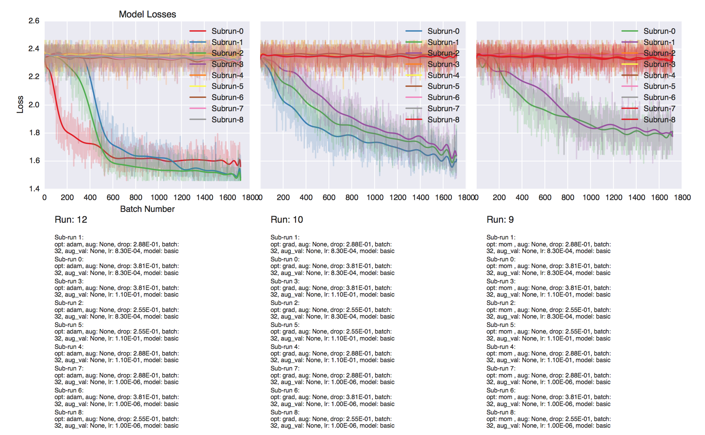
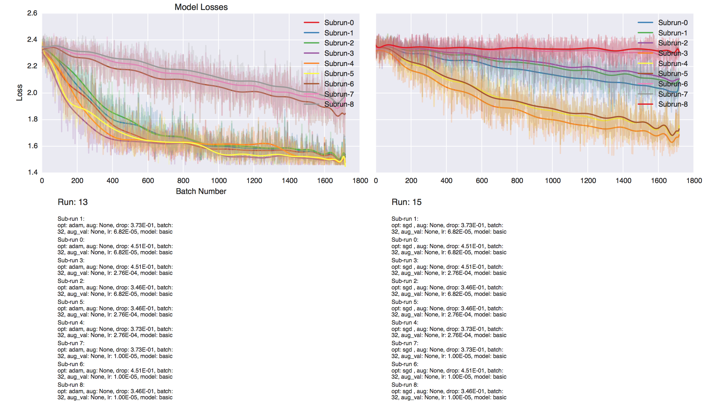
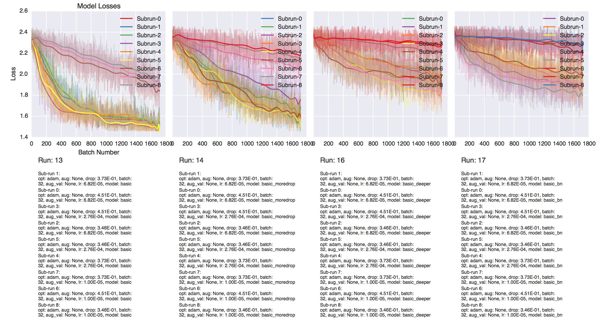
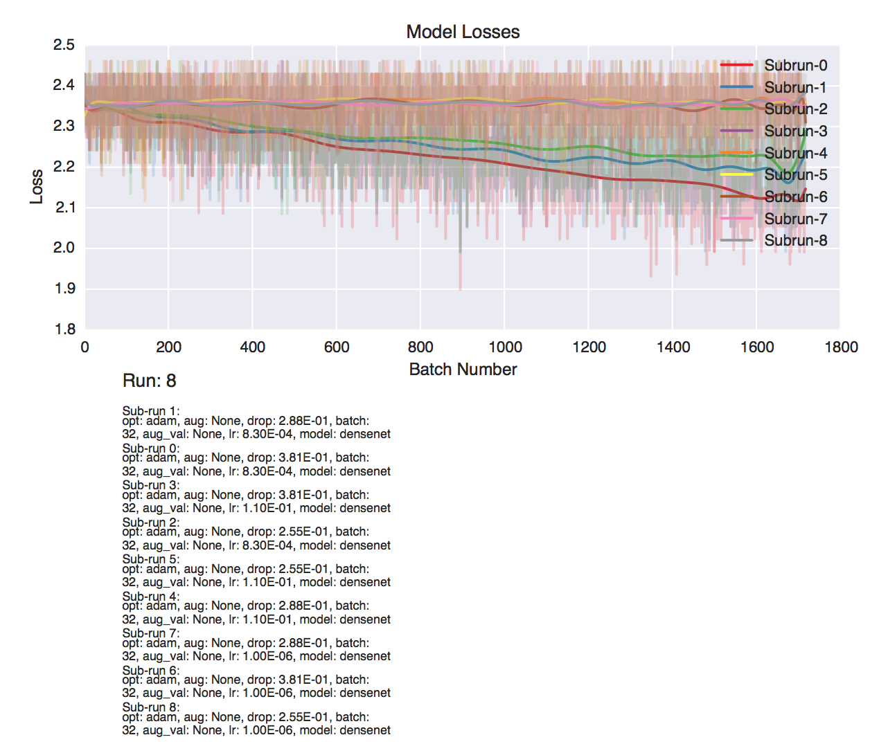

## Additional model exploration

### Optimization functions/learning rate

The graph shows a few different runs over the basic model using a grid search. There are two major takeaways from this graph. Adam in this case is the best model, and a low enough learning rate is required in all 3 to even converge. This encouraged me to adjust my learning rate on my grid search to 1e-5 to 1e-3.

Once adjusted, we can still see a pretty clear difference in the optimizers. As long as you grid search over the learning rates and choose the right one, certain optimizers will still converge faster.

### Number of layers/model complexity

As somewhat expected, the larger the model is, the more training is required to hit the overfitting/ending point.

For example if we look at the basic model, we hit 96% accuracy within the first epoch. With our deeper models, they seem equally be headed to that level of accuracy just at a slower rate.

In some cases, if the model is too large, it won't even necessarily converge. This happened with the densenet model as seen below.

