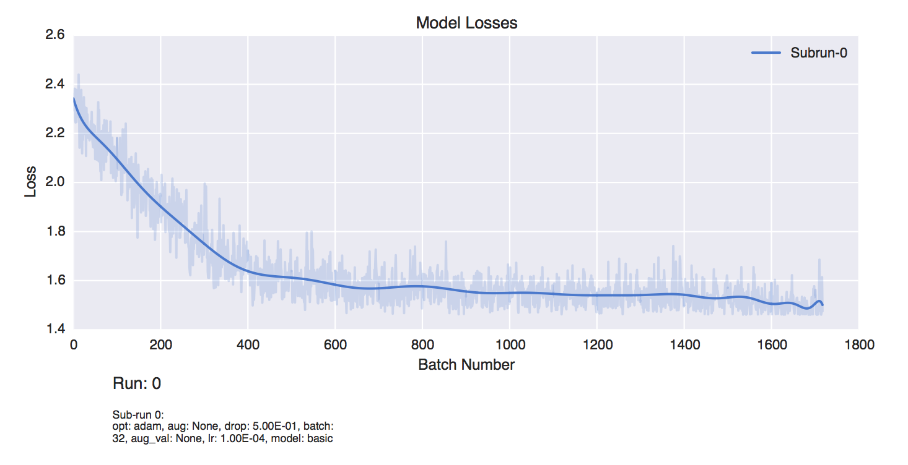
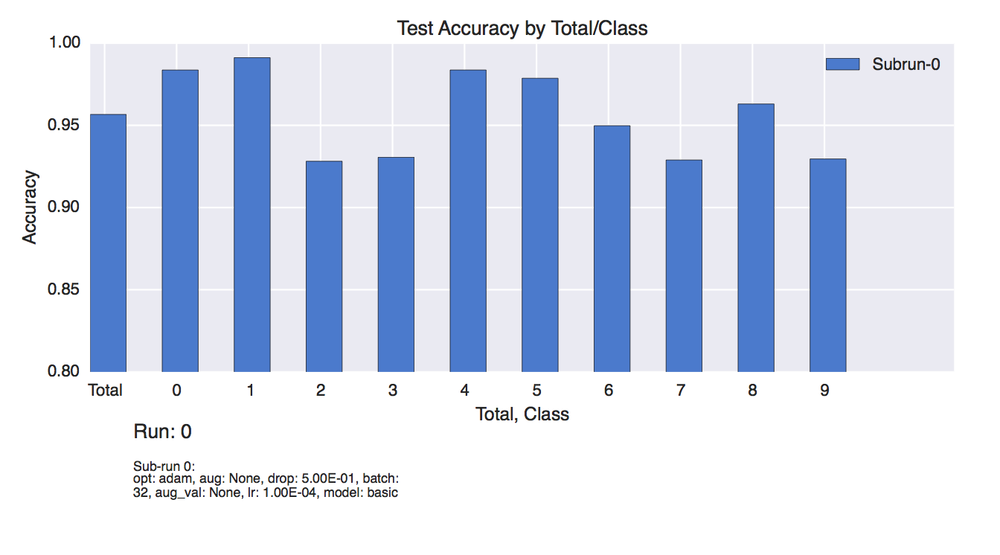
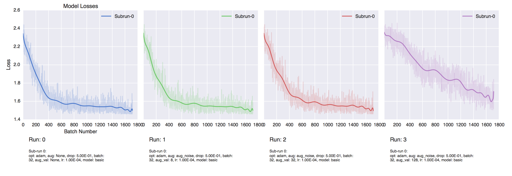
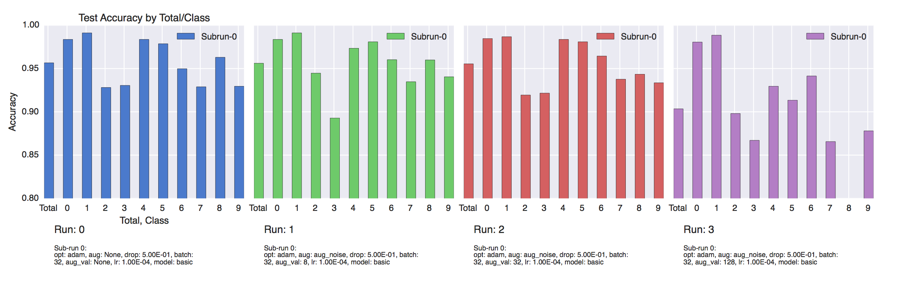
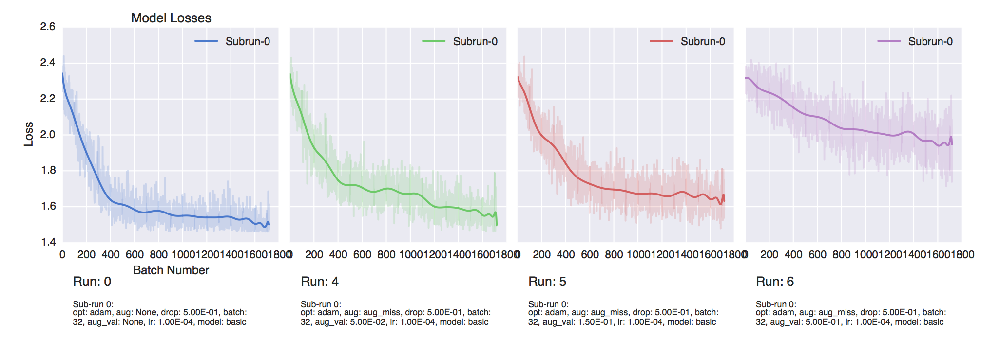
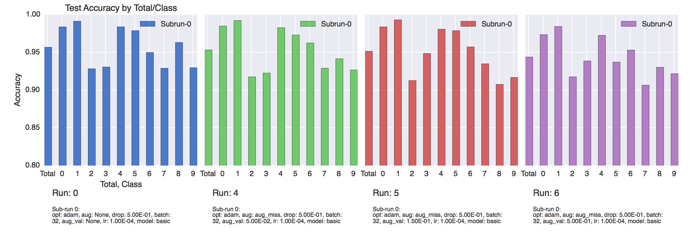

# Q/A

For all of these, I will use comparisons of the basic MNIST model. It will provide a good foundation for most of the insights to the questions.

I'll leave additional exploration to the appropriately named md file.

# Part 1: Classifier on original data

### What is your test set error rate?
### What is the test set error rate for each class? Are some classes more challenging than others to distinguish from each other? Why?
|Class|Acc|
|-----|-----|
|Total|95.66|
|0    |98.37|
|1    |99.12|
|2    |92.82|
|3    |93.06|
|4    |98.37|
|5    |97.87|
|6    |94.98|
|7    |92.89|
|8    |96.30|
|9    |92.96|

Some classes are much harder to predict than others. Looking at some of the misclassified examples, it's easy to see why the 7s could be misinterpreted as 1s or 9s. Similar with the 9s being interpreted as 1s or 7s or even 4s.

2s and 3s I think occasionally get misinterpreted as each other and 8s.

### Based only on information gathered in the first epoch of training, do you think that the model would benefit from more training time? Why?
I know from previous experience with this data set that model will indeed get better with additional time. However, I think this can also be seen in the graph of the loss function. It is still declining as we end the epoch.

The best way to really see this, is tracking the validation loss at the end of each epoch.

### Besides training for a longer time, what would you do to improve accuracy?
There are several additional hyperparameters that could be tuned to possible improve accuracy. Faster learning rates will get you to the final accuracy faster. Possibly additional layers. Additional dropout/regularization might help. Batch normalization might help. Changing the optimization function and activation functions might help as well.

I will explore these in the additional exploration file.

# Part 2: Added image noise

|Digit|Run 0|Run 1|Run 2|Run 3|
|-----|-----|-----|-----|-----|
|Total|95.66|95.61|95.54|90.34|
|0    |98.37|98.37|98.47|98.06|
|1    |99.12|99.12|98.68|98.85|
|2    |92.82|94.47|91.94|89.81|
|3    |93.06|89.29|92.16|86.71|
|4    |98.37|97.35|98.37|92.96|
|5    |97.87|98.09|98.09|91.35|
|6    |94.98|96.03|96.44|94.14|
|7    |92.89|93.48|93.77|86.56|
|8    |96.30|95.99|94.35|76.36|
|9    |92.96|94.05|93.35|87.80|

### What are the implications of the dependence of accuracy on noise if you were to deploy a production classifier? How much noise do you think a production classifier could tolerate?
The pretty obvious implication is that the noisier your training set is, the harder time the network has with your test set.

I think the level of noise it could tolerate is dependent on the purpose of your classifier. Overall the accuracy holds pretty well between runs 0, 1, and 2. And doesn't take a big dip until run 3 (128 stdev).

If the goal is overall accuracy and the loss of certain class accuracy is acceptable, the classifier can take a lot more noise while still producing reasonable results.

### Do you think that Gaussian noise is an appropriate model for real-world noise if the characters were acquired by standard digital photography? If so, in what situations? How would you compensate for it?

My intuition would be against gaussian noise being the most common source. I would imagine noise would appear in scale/chunks. Ie lighter or darker en masse, or if there was a particular light source, it would be distributed across a certain portion of the picture if there was certain brighter/darker areas.

However, after a bit more research, apparently Gaussian noise is pretty common in standard digital photography due to poor illumination, high temperatures or circuit noise.

While there are various forms of filtering that can be applied outside a neural net, things like dropout can help with noise by requiring the net to become reliant on multiple nodes, rather than just 1. This ensures that if the noise is normally distributed, there should be enough unaffected nodes to offset the highly impacted ones.

### Is the accuracy of certain classes affected more by image noise than others? Why?

Some classes are certainly impacted more than others. Looking at the table above, 0 and 1 experience almost no real drop in accuracy even with the most extreme amount of noise.

Contrast that with the 8 which went from one of the more accurate classes to to dropping to 76% accurate between runs 2 and 3.

My intuition for this is that 8 is already composed of all the parts of your other digits (thinking about the digital clock version of each). As you add noise, I'd imagine the center pixels fill and the "eightness" of the digit falls drastically. The net then starts picking up the features of of the other digits.

# Part 3: Label noise

|Digit|Run 0|Run 1|Run 2|Run 3|
|-----|-----|-----|-----|-----|
|Total|95.66|95.31|95.13|94.37|
|0    |98.37|98.47|98.37|97.34|
|1    |99.12|99.21|99.29|98.41|
|2    |92.82|91.75|91.26|91.75|
|3    |93.06|92.26|94.84|93.85|
|4    |98.37|98.27|98.06|97.24|
|5    |97.87|97.30|97.87|93.71|
|6    |94.98|96.23|95.71|95.29|
|7    |92.89|92.89|93.48|90.65|
|8    |96.30|94.14|90.75|93.01|
|9    |92.96|92.66|91.67|92.16|

### How important are accurate training labels to classifier accuracy?
This one was probably the most interesting set of results to me. It looks as if, while the mislabeling has an impact on training and validation accuracies, the test set accuracy remains mostly unchanged.

Therefore, the issue is not so much with accurate predictions, but with a false sense of poor model fit.

During a typical training scenario, you'd assume all the data would be equally mislabeled. Thus when training, you'd see bad performance from both your validation and test set as seen is the model loss curves.

This leads to the greatest risk: abandoning good models due to misinformation.

### How would you compensate for label noise? Assume you have a large budget available but you want to use it as efficiently as possible.

As hinted at above, given enough data/epochs, the model can overcome a mislabeled data set. However, the main issue would be incorrectly assuming your model is bad based off a low validation/test performance.

I'm assuming compensation would be mostly focused around either obtaining correct data, or relabeling the pre-existing set for correct labels.

The training set is definitely lowest priority given the results. After that, I think there are arguments for both validation/test.

I personally would lean towards cleaning up validation data first. This is usually the metric used for comparing and judging models vs each other. Test accuracy is typically not used until after the model is chosen, and is used to report out on.

### How would you quantify the amount of label noise if you had a noisy data set?

Assuming you have a noisy train/val and clean test set, I would quantify it with the difference between the validation and test accuracies.

A significant drop in your validation accuracy while maintaining a consistent test accuracy should correlate with a % of mislabeling of your data.

You can even somewhat see this trend already in training loss graphs above.

### If your real-world data had both image noise and label noise, which would you be more concerned about? Which is easier to compensate for?

From a ground truth accuracy perspective, I'd be much more concerned about image noise. It significantly impacts the predictions given a clean test set.

However, if we assume that our whole data set contains this noise, I'd be more worried about misclassification. There are techniques both external and internal to NNs that can deal with noise. The only real way to fix/understand the impact of mislabeled data is by fixing the labels.
